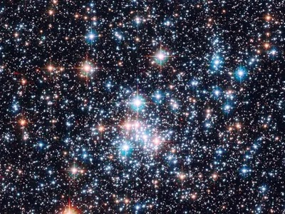

<html lang="en">
<head>
 
</head>
<body>
    <header>
        <h1>Welcome to the World of Stars</h1>
      {
          background-color: green;
          color: blue;
          font-family: Arial, sans-serif;
          margin: 0;
          padding: 0;
      }
    </header>
    

        <h2>Fun Facts about Stars</h2>
        
Stars are fascinating celestial objects that have captured human imagination for centuries. Here are some fun facts about them:

        <ul>
            <li>Stars are giant balls of glowing gas, primarily hydrogen and helium.</li>
            <li>Our Sun is a star, and it provides us with heat and light.</li>
            <li>Stars vary in size, temperature, and brightness.</li>
            <li>The color of a star depends on its temperature, with cooler stars appearing red and hotter stars appearing blue.</li>
            <li>Stars go through various stages of life, including formation, main sequence, and eventually, they can explode as supernovas.</li>
        </ul>
        
Explore the wonders of the night sky and learn more about the mysteries of the universe.

      
      <ol>
          <li>
              <a href="https://www.space.com/57-stars-formation-classification-and-constellations.html">Link to more stars info!</a>
          </li>
      </ol>
      

    

